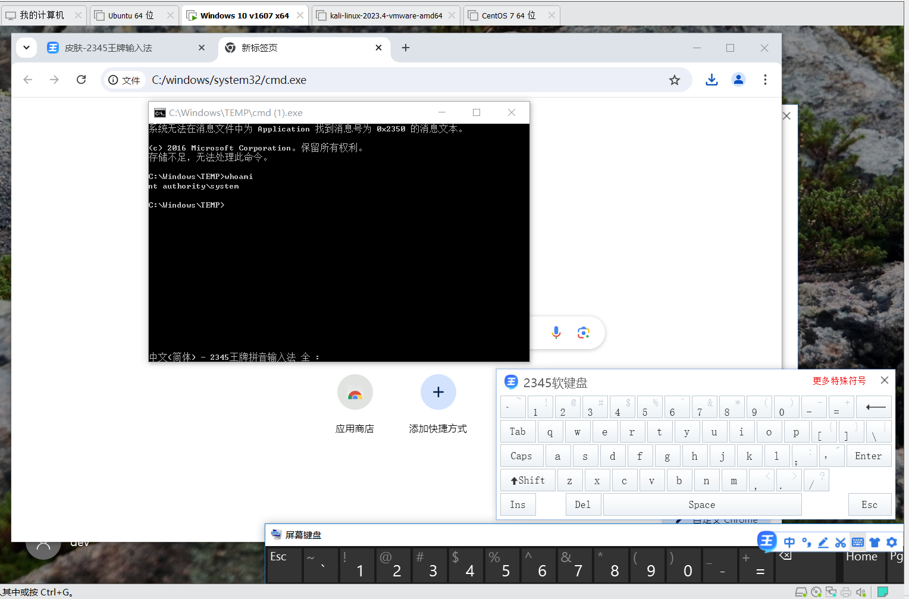
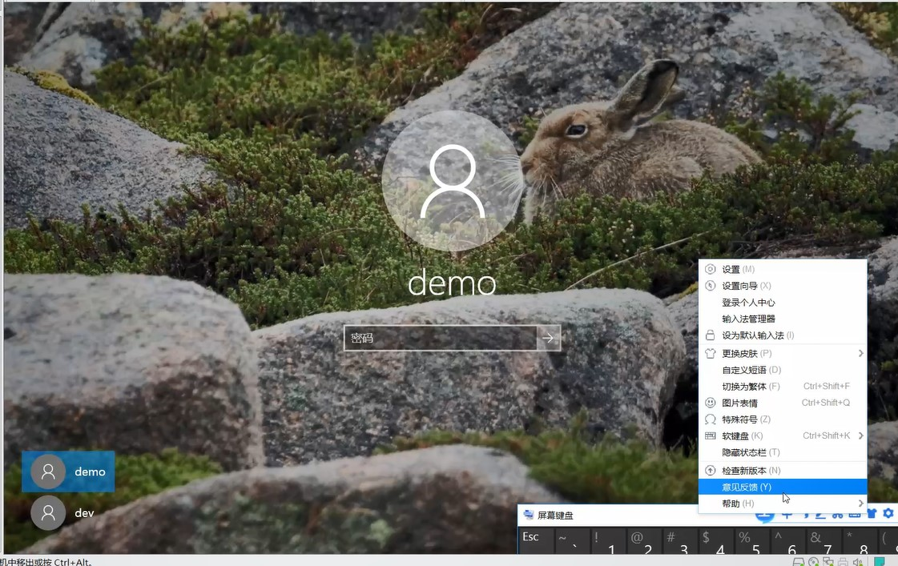
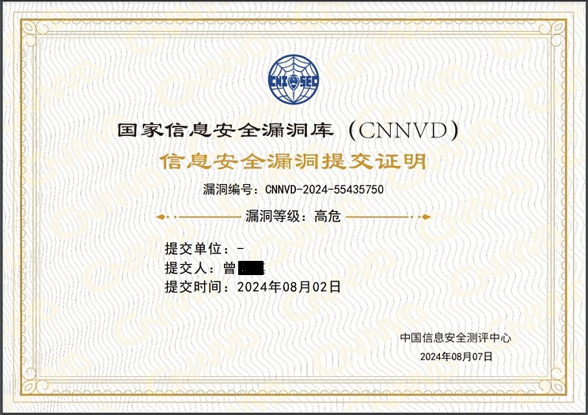

# 2345-Input-method-Software_Insecure-configuration-RCE

## Vulnerability Overview

- BUG_Author: YiQi Zeng
- Vulnerability Name: 2345-Input-method-Software_Insecure-configuration-RCE
- Vulnerability Type: Insecure-configuration-RCE,**Can use `NT AUTHORITY\SYSTEM` to execute the malicious command**
- Vulnerability Level: High risk
- Vulnerability Affecting product: 2345-Input-method-Software([2345王牌输入法](https://pinyin.2345.cc/))
- Software: [https://dl.2345.cc/pinyin/2345pinyin_v7.9.1.8332.exe](https://dl.2345.cc/pinyin/2345pinyin_v7.9.1.8332.exe)
- Vulnerability Affected Version: Version <= V7.9

The software installation package is stored in the [**Installation-package**](https://github.com/AabyssZG/2345-Input-method-Software_Insecure-configuration-RCE/tree/main/Installation-package) directory

## Vulnerability Details

First step, on the Windows lock screen page, the status bar of 2345 intelligent input method can be summoned through the on-screen keyboard

Second step, by calling the function point of the input method, the browser is successfully opened, and then the browser can be called to CMD to execute the malicious command

**Can use `NT AUTHORITY\SYSTEM` to execute the malicious command**

## Vulnerability Demo Video

https://github.com/user-attachments/assets/aa54ad25-fffa-493b-acff-0065a089679f

## Vulnerability Certificate

The vulnerability passed the review of China's national vulnerability database, and the result was a high-risk vulnerability, and the number has not been disclosed

